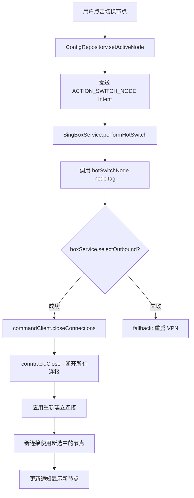

# 热切换节点修复方案

## 问题描述

用户报告：开启 VPN 时切换节点，切换到的新节点不生效，依旧是旧的节点，必须断开重连才能使用新节点。

**案例**：一开始用香港节点，之后热重载为印尼节点，访问谷歌，IP 显示为香港。

## 问题根本原因

通过分析 NekoBoxForAndroid 的实现和当前项目代码，发现：

1. **`selectOutbound()` 只改变 Selector 的当前选择**，但不会断开已建立的连接
2. **已有的 TCP/UDP 连接仍然绑定在旧节点上**
3. **当前项目缺少在热切换后调用 `closeConnections()` 或 `resetAllConnections()`**

### NekoBox 的实现参考

NekoBox 在 [`BaseService.kt:61`](../NekoBoxForAndroid/app/src/main/java/io/nekohasekai/sagernet/bg/BaseService.kt:61) 中，在网络变化和设备唤醒时会调用：
```kotlin
Libcore.resetAllConnections(true)
```

这个函数在 [`box.go:61-68`](../NekoBoxForAndroid/libcore/box.go:61) 中实现，最终调用 `conntrack.Close()` 来关闭所有被追踪的连接。

### 官方 libbox 的支持

官方 sing-box 的 libbox 也提供了类似功能：

1. **`CommandClient.CloseConnections()`** - 通过 CommandClient 发送命令
2. **`conntrack.Close()`** - 需要 `with_conntrack` build tag

## 修复方案

### 1. 修改构建脚本

**文件**: [`buildScript/tasks/build_libbox.ps1`](../buildScript/tasks/build_libbox.ps1)

**第 76 行**，添加 `with_conntrack` tag：

```powershell
# 修改前
$BUILD_TAGS = "with_gvisor,with_quic,with_wireguard,with_utls,with_clash_api"

# 修改后
$BUILD_TAGS = "with_gvisor,with_quic,with_wireguard,with_utls,with_clash_api,with_conntrack"
```

### 2. 修改热切换逻辑

**文件**: [`app/src/main/java/com/kunk/singbox/service/SingBoxService.kt`](../app/src/main/java/com/kunk/singbox/service/SingBoxService.kt)

**`hotSwitchNode` 方法**（约第 187-282 行），在 `selectOutbound` 成功后添加 `closeConnections()` 调用：

```kotlin
fun hotSwitchNode(nodeTag: String): Boolean {
    if (boxService == null || !isRunning) return false
    
    try {
        val selectorTag = "PROXY"
        Log.i(TAG, "Attempting hot switch to node tag: $nodeTag via selector: $selectorTag")
        
        val method = boxService?.javaClass?.getMethod("selectOutbound", String::class.java)
        if (method != null) {
            val result = method.invoke(boxService, nodeTag) as Boolean
            if (result) {
                Log.i(TAG, "Core accepted selectOutbound: $nodeTag")
                
                // ========== 关键修复：关闭所有现有连接 ==========
                try {
                    commandClient?.closeConnections()
                    Log.i(TAG, "Closed all existing connections after hot switch")
                } catch (e: Exception) {
                    Log.w(TAG, "Failed to close connections after hot switch", e)
                }
                // ================================================

                realTimeNodeName = nodeTag
                updateNotification()
                return true
            } else {
                Log.w(TAG, "Core rejected selectOutbound: $nodeTag (selector not found or tag invalid)")
            }
        } else {
            Log.w(TAG, "BoxService.selectOutbound method not found")
        }
    } catch (e: Exception) {
        Log.e(TAG, "Hot switch failed with exception", e)
    }
    
    return false
}
```

## 技术原理



### 为什么这个修复有效

1. **`selectOutbound(tag)`** - 改变 Selector 的当前选择（内存状态）
2. **`closeConnections()`** - 发送 `CommandCloseConnections` 命令到 CommandServer
3. **`conntrack.Close()`** - 关闭所有被追踪的 TCP/UDP 连接
4. **新连接** - 关闭现有连接后，应用会自动重新建立连接，这些新连接会通过当前选中的节点路由

### `with_conntrack` 的作用

`conntrack` 模块的启用由 build tag 控制：

- [`common/conntrack/track_enable.go`](../buildScript/singbox-build/common/conntrack/track_enable.go)：`//go:build with_conntrack`
- [`common/conntrack/track_disable.go`](../buildScript/singbox-build/common/conntrack/track_disable.go)：`//go:build !with_conntrack`

没有 `with_conntrack` tag 时，`conntrack.Close()` 是空操作。

## 实施步骤

1. **修改构建脚本**：添加 `with_conntrack` tag
2. **重新构建 libbox.aar**：运行 `buildScript/tasks/build_libbox.ps1`
3. **修改 SingBoxService.kt**：在热切换成功后调用 `closeConnections()`
4. **编译测试**：构建 APK 并测试热切换功能

## 测试验证

1. 连接香港节点，访问 https://ip.sb 确认 IP 为香港
2. 不断开 VPN，切换到印尼节点
3. 刷新 https://ip.sb，确认 IP 变为印尼
4. 如果切换成功，说明修复有效

## 相关文件

- [`buildScript/tasks/build_libbox.ps1`](../buildScript/tasks/build_libbox.ps1) - libbox 构建脚本
- [`app/src/main/java/com/kunk/singbox/service/SingBoxService.kt`](../app/src/main/java/com/kunk/singbox/service/SingBoxService.kt) - VPN 服务
- [`NekoBoxForAndroid/libcore/box.go`](../NekoBoxForAndroid/libcore/box.go) - NekoBox 参考实现
- [`buildScript/singbox-build/experimental/libbox/command_conntrack.go`](../buildScript/singbox-build/experimental/libbox/command_conntrack.go) - 官方 libbox 连接追踪命令